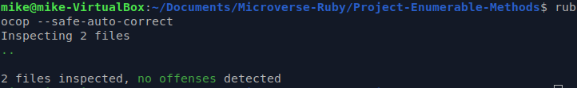

# Project-Enumerable-Methods

<!-- PROJECT SHIELDS -->
<!--
*** I'm using markdown "reference style" links for readability.
*** Reference links are enclosed in brackets [ ] instead of parentheses ( ).
*** See the bottom of this document for the declaration of the reference variables
*** for contributors-url, forks-url, etc. This is an optional, concise syntax you may use.
*** https://www.markdownguide.org/basic-syntax/#reference-style-links
-->
[![Contributors][contributors-shield]][contributors-url]
[![Forks][forks-shield]][forks-url]
[![Stargazers][stars-shield]][stars-url]
[![Issues][issues-shield]][issues-url]
[![MIT License][license-shield]][license-url]

Rebuilding some Ruby enumerable methods

<!-- PROJECT LOGO -->
 

  

  <h3 align="center"> Ruby Enumerables Implementation</h3>

  

    Ruby enumerables customized version
     
    <a href="https://github.com/mikenath223/Project-Enumerable-Methods/blob/master/README.md"><strong>Explore the docs 📚</strong></a>
     
     
    <a href="https://www.theodinproject.com/courses/ruby-programming/lessons/advanced-building-blocks.">Project Assigment</a>
    🖊️
    <a href="https://github.com/mikenath223/Project-Enumerable-Methods/issues">Report Bug</a>
    🐛
    <a href="https://github.com/mikenath223/Project-Enumerable-Methods/issues"> Feature Request</a>
  

# Project-Enumerable-Methods
Implement a version of Ruby’s enumerable methods.

# Validations

Rubocop: 

# Features

* Creating enumerables methods accepting a block using yield() and #call
* `module` keyword
* Enumerable methods rebuilt
    + [x] [`all?`](https://ruby-doc.org/core-2.6.3/Enumerable.html#method-i-all-3F)
    + [x] [`any?`](https://ruby-doc.org/core-2.6.3/Enumerable.html#method-i-none-3F)
    + [x] [`count`](https://ruby-doc.org/core-2.6.3/Enumerable.html#method-i-none-3F)
    + [x] [`each_with_index`](https://ruby-doc.org/core-2.6.3/Enumerable.html#method-i-each_with_index)
    + [x] [`each`]()
    + [x] [`inject`](https://ruby-doc.org/core-2.6.3/Enumerable.html#method-i-inject)
    + [x] [`map`](https://ruby-doc.org/core-2.6.3/Enumerable.html#method-i-map)
    + [x] [`none?`](https://ruby-doc.org/core-2.6.3/Enumerable.html#method-i-none-3F)
    + [x] [`select`](https://ruby-doc.org/core-2.6.3/Enumerable.html#method-i-none-3F)

# Built With

* `ruby` v2.5.5+
* RVM
* `vscode` with _Ruby_ and _Rubocop_ extensions
* Linux

# Author

* [Ukeje Michgolden](https://github.com/mikenath223)

# License

This project is licensed under the MIT License - see the [LICENSE.md](LICENSE.md) file for details 

<!-- ACKNOWLEDGEMENTS -->
## Acknowledgements
* [Microverse](https://www.microverse.org/)
* [The Odin Project](https://www.theodinproject.com/)
* [Readme header](https://github.com/collinsugwu/Microverse201-Enumerable-Methods)

<!-- MARKDOWN LINKS & IMAGES -->
<!-- https://www.markdownguide.org/basic-syntax/#reference-style-links -->
[contributors-shield]: https://img.shields.io/github/contributors/othneildrew/Best-README-Template.svg?style=flat-square
[contributors-url]: https://github.com/mikenath223/Project-Enumerable-Methods/graphs/contributors
[forks-shield]: https://img.shields.io/github/forks/mikenath223/Project-Enumerable-Methods
[forks-url]: https://github.com/mikenath223/Project-Enumerable-Methods/network/members
[stars-shield]: https://img.shields.io/github/stars/mikenath223/Project-Enumerable-Methods
[stars-url]: https://github.com/mikenath223/Project-Enumerable-Methods/stargazers
[issues-shield]: https://img.shields.io/github/issues/mikenath223/Project-Enumerable-Methods
[issues-url]: https://github.com/mikenath223/Project-Enumerable-Methods/issues
[license-shield]: https://img.shields.io/github/license/mikenath223/Project-Enumerable-Methods
[license-url]: https://github.com/mikenath223/Project-Enumerable-Methods/blob/master/LICENSE.txt
